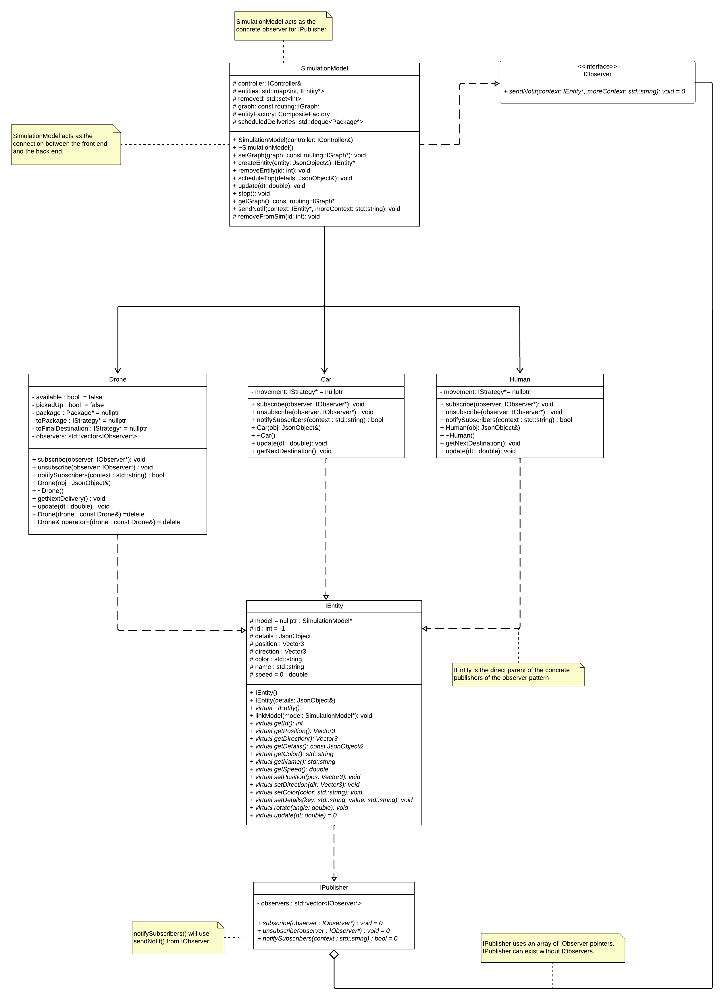
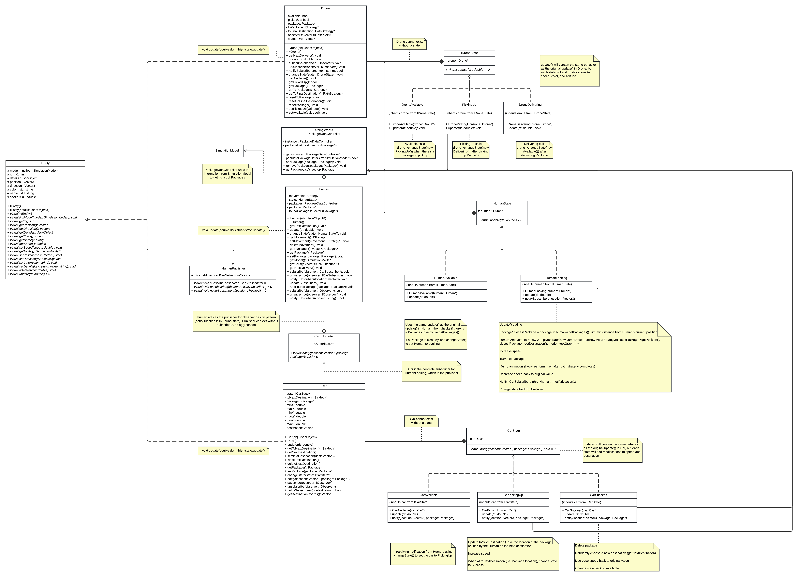

# Drone Simulation Project - Group 16

### **Team Members and x500:**
- Benjamin Lee [lee02819]
- Jing Wang [wan01205]
- Lingyi Xu [xu001032]
- Adam Shahin [shahi068]

### **Project Overview:**
Our project is an advanced drone simulation system designed to realistically model drone delivery dynamics within an interactive environment. The simulation includes various entities like drones, humans, and car pirates, each exhibiting unique behaviors and interactions. The goal is to simulate real-world scenarios in drone delivery, focusing on the challenges and strategies involved in modern delivery systems.

### **How to Run the Simulation:**
- Clone the repository using: `git clone git@github.umn.edu:umn-csci-3081-f23/team-001-16-hw4.git`.
- Navigate to the project directory.
- Execute `make clean; make run`.
- Forward port to 8081 if necessary
- Go to localhost:8081 in your browser of choice
- The simulation interface will launch, displaying the interactive environment.

### **Simulation Features:**
- **Dynamic Entity Movement:** Drones, humans, and cars move within the simulation, following specific behavior patterns.
- **Package Delivery System:** Drones simulate the process of picking up and delivering packages amidst various challenges.
- **Package Stealing Ability:** Car pirates can intercept and steal packages, adding complexity to the drone deliveries.
- **Real-Time Notifications:** Uses the Observer Pattern to inform users of significant events like drone progress, human movements, and car actions, displayed in a notification bar.
- **Interactive User Interface:** Provides a platform for users to observe and interact with the simulation. Users can schedule deliveries and observe specific entities in the model.

### **UML Diagrams:**
Below are the UML diagrams representing the architecture and design patterns used in our simulation.

*Figure 1: UML Diagram illustrating the implementation of our first extension.*

*Figure 2: UML Diagram showing the implementation of our second extension.*

### **New Features - State + Observer Pattern Implementation and Notification Bar:**

#### **What do they do?**
- **State-Based Behaviors:** Introduces states for drones, humans, and car pirates. Drones have states like 'Available', 'Picking Up', and 'Delivering'. Humans switch between 'Looking' and 'Found', while car pirates transition through 'Available', 'Picking Up', and 'Success'. When a human in the 'Looking' state finds a package, the human will notify 'Available' cars within a set distance. This will changes the affected cars' state to 'Picking Up,' where the cars attempt to steal the package found by the human.
- **Notification Bar:** Implements the Observer Pattern to display real-time notifications in the simulation's UI, including detailed steps of drone, human, and car pirate actions.

#### **Why are they significantly interesting?**
These features introduce a dynamic and strategic element to the simulation, reflecting the complexity of real-world interactions and challenges in drone delivery systems. The front-end notification bar then allows for the user to easily see how the model is changing due to these strategic additions.

#### **How do they add to the existing work?**
These new features enhance the simulation's realism and educational value, allowing users to observe and understand the adaptive behaviors and interactions among different entities.

#### **Design Pattern Implementation:**
- The State Pattern is used for dynamic behavior changes in entities, perfect for scenarios where objects must adapt their actions based on internal states. An implementation of the Observer pattern is then used to allow one entity in a specific state to notify other entities of a different state.
- The Observer Pattern is also used to implement the notification bar, efficiently broadcasting updates on entity activities to the user.

#### **Instructions for the New Features:**
- **State-Based Behaviors:** Watch how humans, drones, and car pirates change their actions as they transition between states. Also focus on how humans notify cars when a package is found.
- **Notification Bar:** View the notification bar for live updates on entity activities. This feature operates automatically as part of the simulation.

### **YouTube Video Presentation:**
<iframe
    width="640"
    height="480"
    src="https://youtu.be/zuJI1txGxho"
    frameborder="0"
    allow="autoplay; encrypted-media"
    allowfullscreen
>
</iframe>
